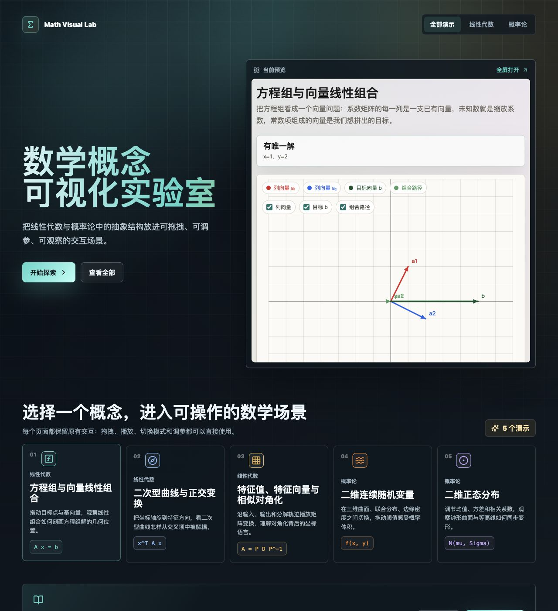
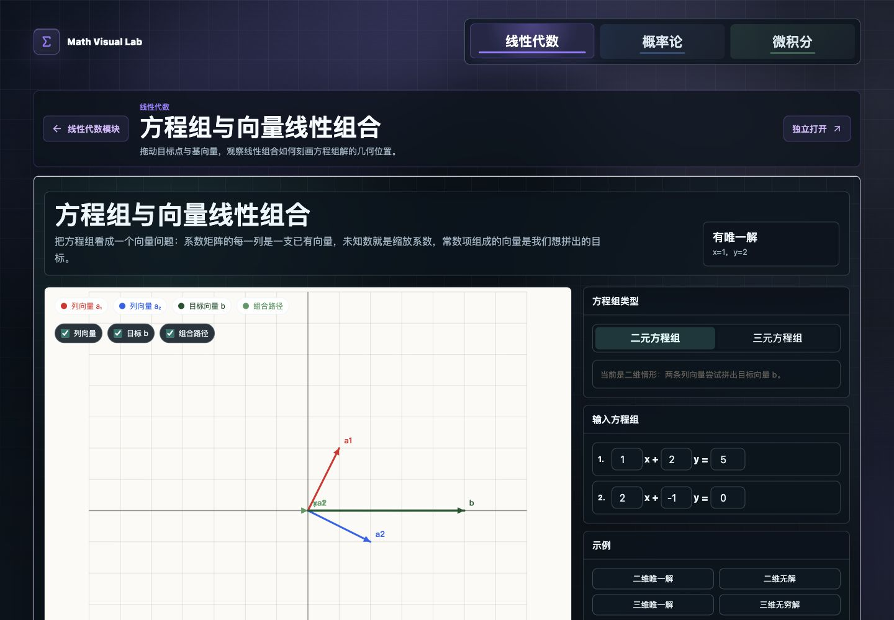
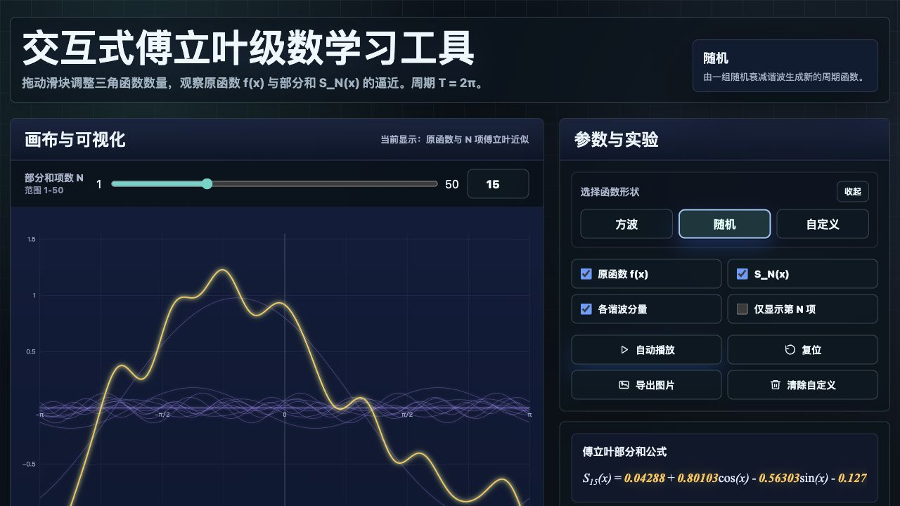

# Visual_MathLab

<p align="center">
  <strong>一个面向高等数学学习的交互式可视化实验室</strong><br />
  将线性代数、概率论与微积分中的抽象概念转化为可拖拽、可调参、可观察的动态场景。
</p>

<p align="center">
  <a href="https://litianyihku.github.io/Visual_MathLab/"><strong>在线体验</strong></a>
  ·
  <a href="#实验模块">实验模块</a>
  ·
  <a href="#本地运行">本地运行</a>
</p>

<p align="center">
  
  
  
  
</p>

<p align="center">
  <a href="https://litianyihku.github.io/Visual_MathLab/">
    
  </a>
</p>

## 项目简介

Visual_MathLab 不是传统的静态数学笔记，而是一组可直接操作的数学实验场景。项目把“公式、图像、参数、运动过程”放到同一个界面中，让学习者通过拖动、切换、播放和观察，理解概念背后的几何与概率结构。

当前项目覆盖三大板块：

- **线性代数**：方程组、向量线性组合、二次型、特征值与对角化。
- **概率论**：二维连续随机变量、二维正态分布、正态分布函数、抽样分布、中心极限定理。
- **微积分**：曲线积分、傅立叶级数、对坐标的曲面积分。

## 视觉预览

<table>
  <tr>
    <td width="50%">
      
    </td>
    <td width="50%">
      
    </td>
  </tr>
  <tr>
    <td><strong>向量与方程组</strong><br />拖动目标点和基向量，观察线性组合如何对应方程组的几何解。</td>
    <td><strong>傅立叶级数</strong><br />调整部分和项数，比较原函数与近似曲线的收敛过程。</td>
  </tr>
</table>

## 设计目标

- **把抽象概念变成可见结构**：用图形、轨迹、曲面、向量和面积帮助理解公式。
- **保留数学严谨性**：每个实验围绕明确知识点展开，避免只做装饰性动画。
- **面向学习过程**：支持参数调节、模式切换、播放观察和独立打开实验页面。
- **适合课程展示与自学**：可作为课堂演示、学习辅助工具或数学可视化作品集。

## 实验模块

| 板块 | 模块 | 核心观察点 |
| --- | --- | --- |
| 线性代数 | 方程组与向量线性组合 | 线性组合、目标向量、解的几何位置 |
| 线性代数 | 二次型曲线与正交变换 | 交叉项消去、坐标旋转、特征方向 |
| 线性代数 | 特征值、特征向量与相似对角化 | 矩阵变换、特征方向、对角化分解 |
| 概率论 | 二维连续随机变量 | 联合密度、边缘密度、概率体积 |
| 概率论 | 二维正态分布 | 均值、方差、相关系数与等高线 |
| 概率论 | 正态分布与分布函数 | 钟形曲线、左侧面积、分布函数值 |
| 概率论 | 抽样分布 | 卡方分布、F 分布、t 分布与自由度 |
| 概率论 | 中心极限定理：骰子 | 个体分布与样本均值分布的差异 |
| 概率论 | 中心极限定理：学生身高 | 个体波动与班级均值波动 |
| 微积分 | 曲线积分 | 向量场、路径运动、做功累计 |
| 微积分 | 傅立叶级数 | 周期函数、谐波分量、部分和逼近 |
| 微积分 | 对坐标的曲面积分 | 三维曲面、坐标面投影、通量贡献 |

## 技术栈

- **React 18**：组织首页、学科导航、模块卡片和实验容器。
- **Vite**：提供本地开发、生产构建和 GitHub Pages 发布产物。
- **Canvas / SVG / 原生交互**：承载数学图形、动态曲线和可拖拽实验。
- **Lucide React**：用于统一、清晰的界面图标。
- **GitHub Actions + GitHub Pages**：每次推送到 `main` 后自动构建并发布在线版本。

## 本地运行

```bash
npm install
npm run dev
```

构建生产版本：

```bash
npm run build
```

预览构建结果：

```bash
npm run preview
```

## 项目结构

```text
.
├── src/                 # React 首页、导航和模块展示
├── 线性代数/             # 线性代数独立实验页面
├── 概率论/               # 概率论独立实验页面
├── 微积分/               # 微积分独立实验页面
├── vendor/              # 独立实验所需的本地依赖文件
├── docs/assets/         # README 展示图片
└── .github/workflows/   # GitHub Pages 自动发布流程
```

## 在线发布

项目已部署到 GitHub Pages：

<p>
  <a href="https://litianyihku.github.io/Visual_MathLab/">
    <strong>https://litianyihku.github.io/Visual_MathLab/</strong>
  </a>
</p>

只要新的代码推送到 `main` 分支，GitHub Actions 会自动执行构建，并将 `dist/` 发布为最新网页。
